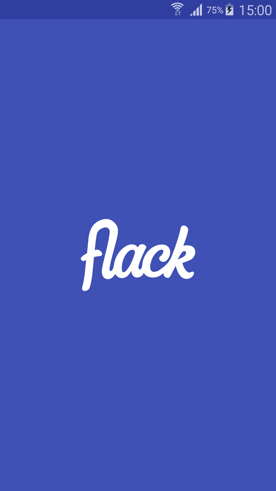
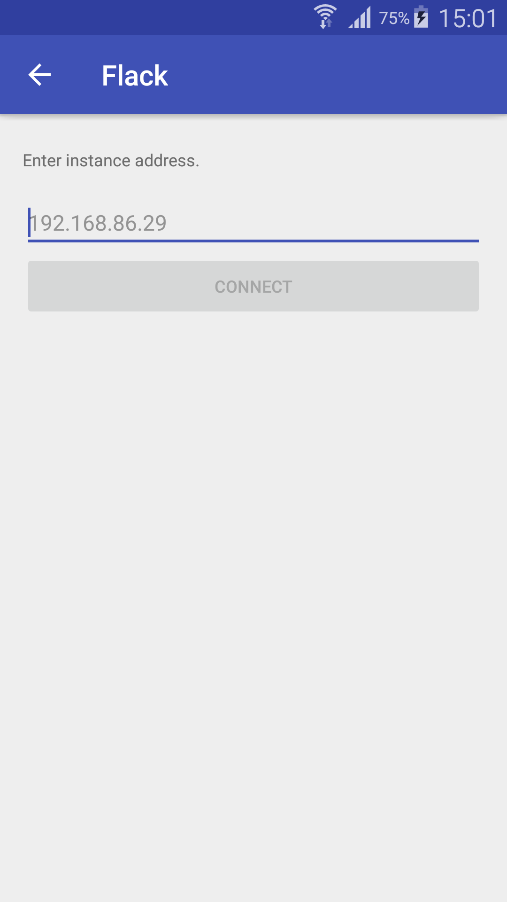
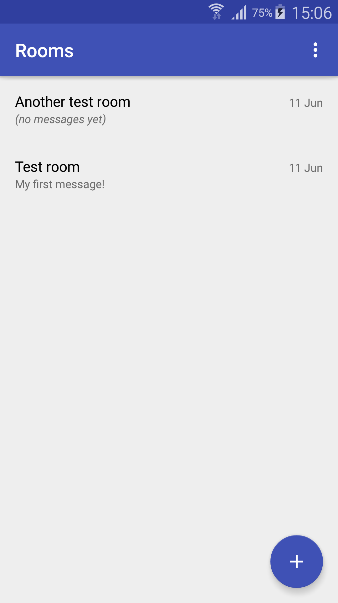
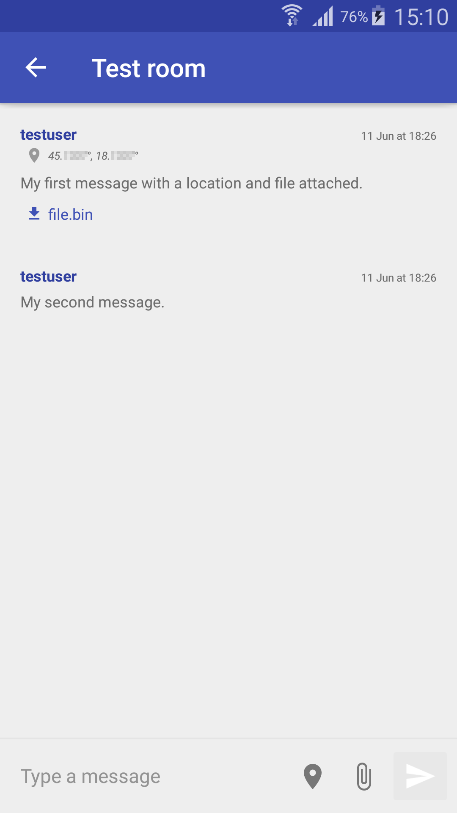
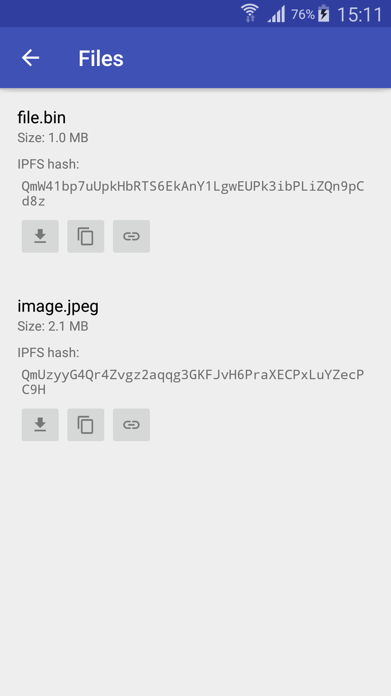

# Flack

Flack is a simple chat system relying on WebSocket protocol to provide
quasi-realtime communication and IPFS to store files shared in conversations.
Conversations are organized as rooms, where each room has at least two
participants. Participants can send messages and optionally attach their GPS
location and files to them.

This is the repository for Flack's Android client application. It uses OkHttp
for REST-based communication with the
[server](https://github.com/skomaromi/flack-server), Rabtman's WsManager for
WebSocket support with automatic reconnection and Material File Picker by
nbsp-team for file uploads.

## Screenshots

&nbsp;
&nbsp;
&nbsp;
&nbsp;

## Installation

1. Ensure a Flack [server](https://github.com/skomaromi/flack-server) instance
is running and reachable.

2. Download and install the [client APK](app/release/app-release.apk) to your
device.

3. Start Flack on your device and connect to the instance by entering its IP
or DNS address.
